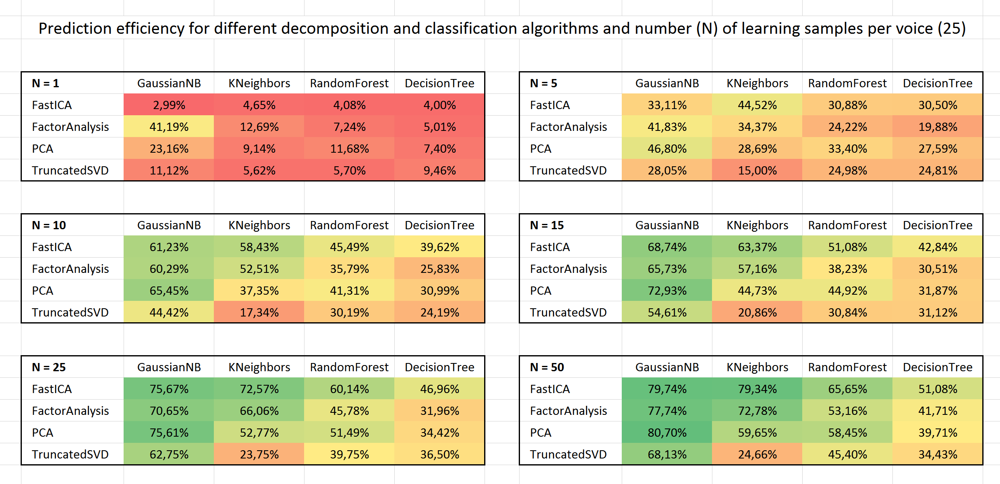
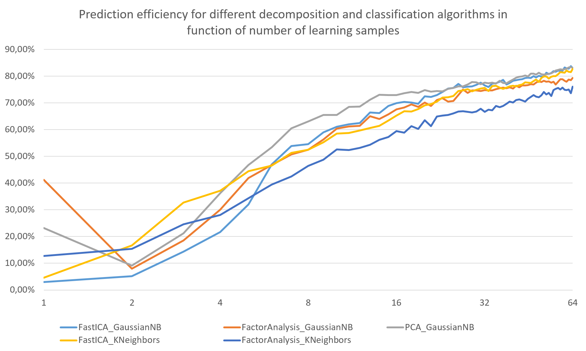
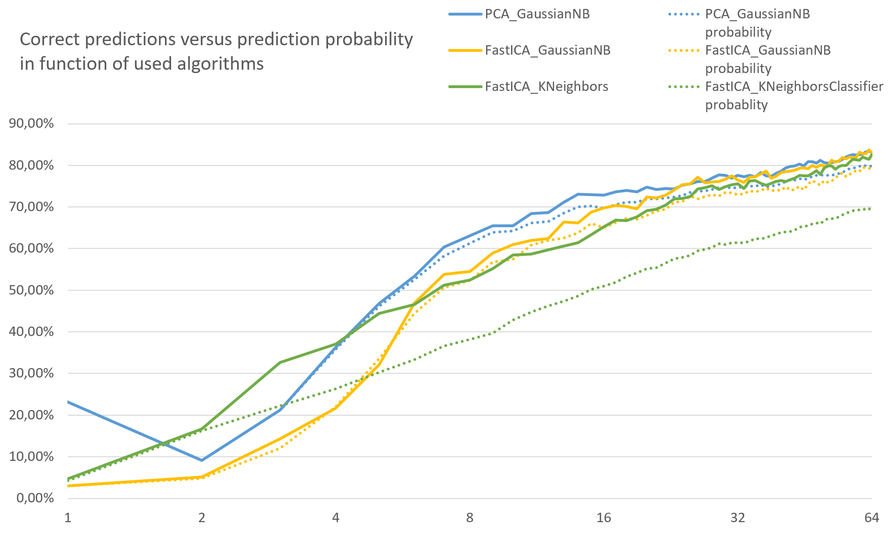
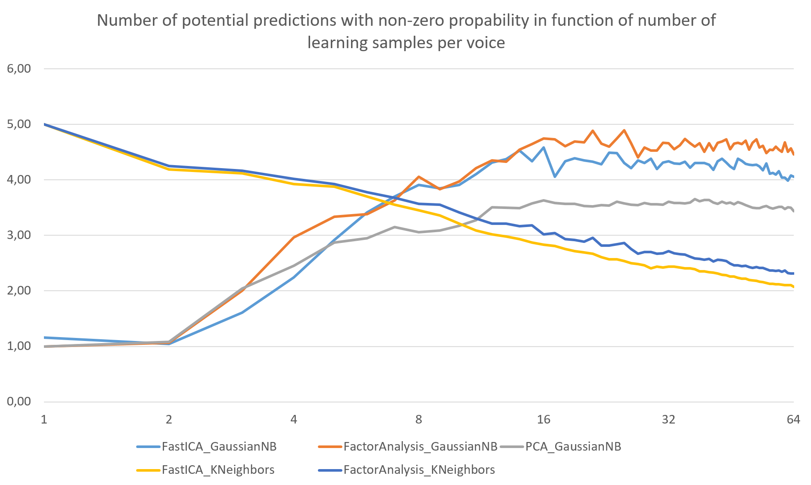
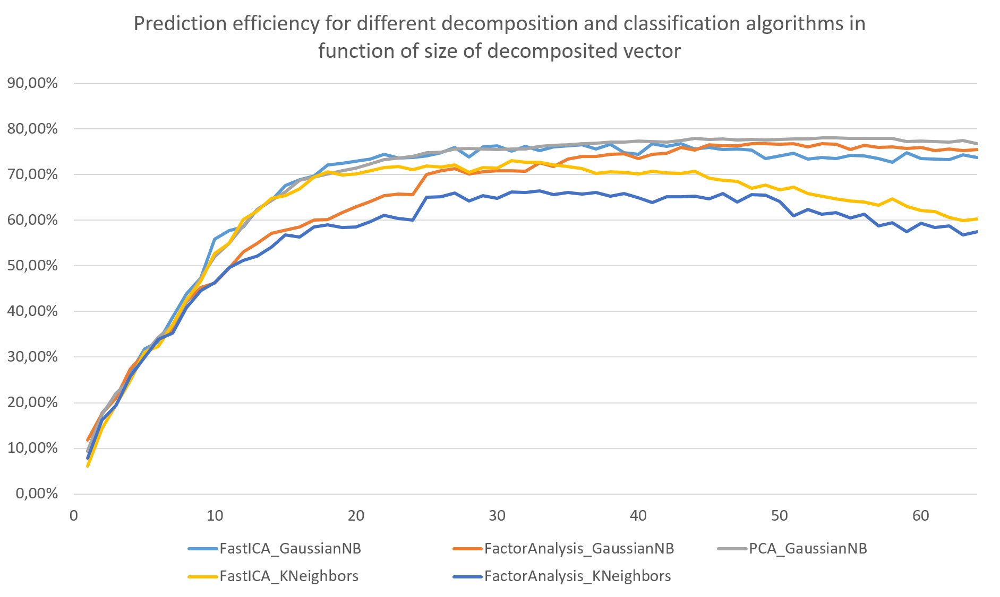
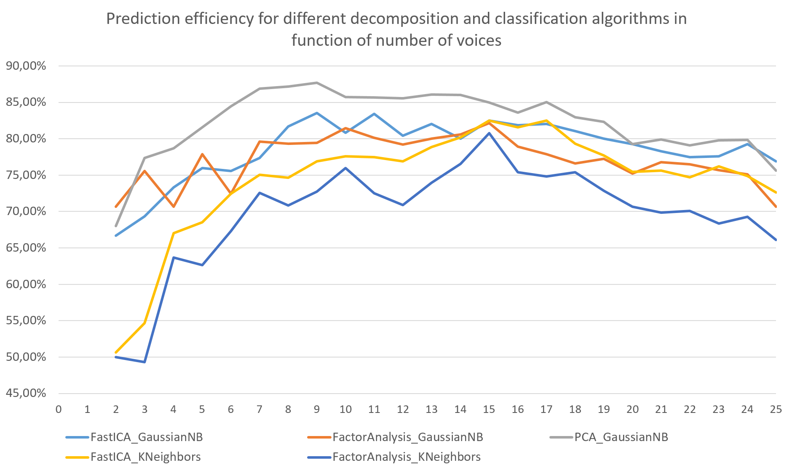

# VoiceClassifier

This project was created to explore the basics aspects of the speacher recognition techniques. In the following chapters most of the gained knowledge will be discussed.

## Database

In order to compare various algorithms, the apprioprate database was created. It consists of 25 voices with 100 samples each. This data was collected from the Shtooka Project available at [http://shtooka.net/](http://shtooka.net/) which is a multilingual database of audio recordings of words.

## Programming environment

This project is created in the Python language and uses the Anaconda library, an open data science platform. Below are listed all used Python packages:

- numpy,
- scipy,
- soundfile.

# Analysis process

The process of analysing the voice samples is really simple and is based on the following steps:

1. For all samples:
    1. Read an audio file containing record of one word.
    2. Use the preemphasis filter to emphasize highest frequencies.
    3. Perform the FFT transform on the signal.
    4. Change the Y scale from energy to decibels.
    5. Use the decomposition algorithm on the FFT to get the feature vector.
5. Divide the samples into two groups: learning and testing.
6. Train the data model using the classifier algorithm and learning samples.
7. Check the prediction efficiency using the samples from the testing group.

## Decomposition and classification algorithms

In this project were tested some of the algorithms available in the Sklearn library.

Following decomposition algorithms were used:

- PCA,
- FactorAnalysis, 
- FastICA, 
- TruncatedSVD.

Following classification algorithms were used:

- KNeighborsClassifier, 
- GaussianNB,
- RandomForestClassifier, 
- DecisionTreeClassifier.

# Results

It is important to say that different algorithms are apprioprate for different scenarios. In this section, the process of finding the best techniques for gathered database will be covered.

## Default settings

At the very beggining, the initial and default settings were choosen as following:

```
NUMBER_OF_VOICES = 25
NUMBER_OF_SAMPLES = 100

FFT_COMPONENTS = 4096

DECOMPOSITION_ALGORITHM = PCA
DECOMPOSITION_COMPONENTS = 32

CLASSIFIER_ALGORITHM = GaussianNB

SAMPLES_TO_LEARN = 10
```

## The best algorithms

To choose the best pair of decomposition and classification alogirthms, all permutations were tested for different number of learning samples.



As you can see, 5 pairs are really interesting:

- (FastICA, GaussianNB),
- (FactorAnalysis, GaussianNB),
- (PCA, GaussianNB),
- (FastICA, KNeighborsClassifier),
- (FactorAnalysis, KNeighborsClassifier),.

## Predictions

The Sklearn library is taking the features vector of the sample from the decomposition algorithm and thanks to the learned classification model is attaching the probabilities to every voice. Next step is choose the voice with the highest probability. This chart shows the efficiency of this method:



Next, you can find the average probability for the correct voice. As you can see, the probability of the pair (FastICA, KNeighbors) does not match the prediction rate as well as two other pairs.



## Non-zero probabilities

For vast majority of cases, the number of voices with non-zero probability is really small.



This image is very interesting beacause shows the very big difference between the GaussianNB and KNeighbors algorithms. The second one is choosing less potential candidates for bigger learning set when the first one is pretty stable.

## Lenght of the feature vector

Using the decomposition algorithms, it is possible to shorten the FFT data into feature vector. The question is, how long should be this vector for this method, voice analysis and given dataset?



As you can see, the accuracy of prediction is not stable and can decrease for too large vectors.

## Number of voices

The last think to discuss, is the accuracy of prediction in the function of number of voices. It is predicted that more voices will decrease the accuracy:



# Conclusions

In this project, many basic methods of analysis were covered. As the above charts show, it is very important to compare many available methods in due to optimize the results. By using more advanced techniques, better results can be obtained.