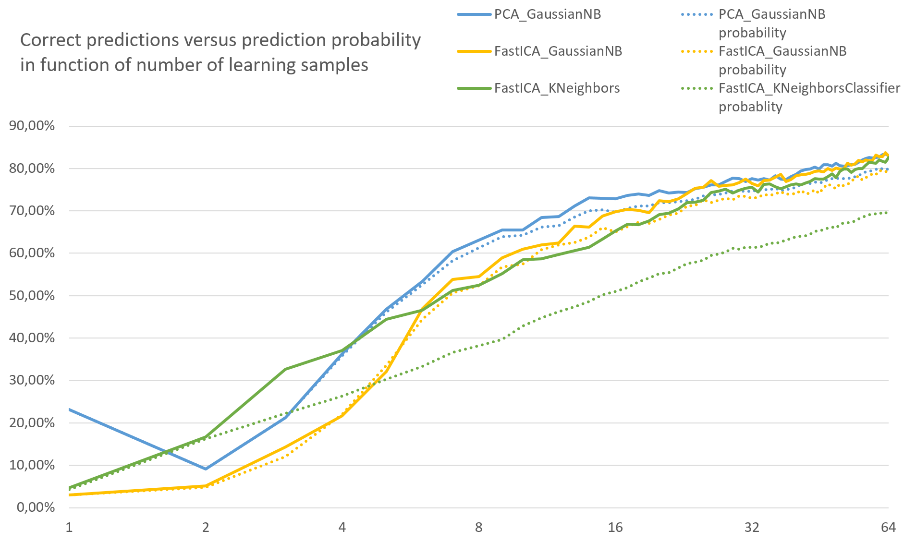

# VoiceClassifier

This project was created to explore the basic aspects of the speaker recognition techniques: decomposition and classification algorithms and methods of analysis as well. In the following chapters, most of the gained knowledge will be discussed.

Additionally, it was not indeded to be an analysis tool and should not be used in that fashion. It does not adress many important issues like data validation or correct exception handling.

## Database

In order to compare various algorithms, the appropriate database was created. It consists of 25 voices with 100 samples each. This data was collected from the Shtooka Project available at [http://shtooka.net/](http://shtooka.net/) which is a multilingual database of audio recordings of words.

## Programming environment

This project is created in the Python language and uses the Anaconda library, an open data science platform. Below are listed all used Python packages:

- numpy,
- scipy,
- soundfile.

# Analysis process

The process of analysing the voice samples is really simple and is based on the following steps:

1. For all samples:
    1. Read an audio file containing the record of one word.
    2. Use the preemphasis filter to emphasise highest frequencies.
    3. Perform the FFT transform on the signal.
    4. Change the Y scale from energy to decibels.
    5. Use the decomposition algorithm on the FFT to get the feature vector.
5. Divide the samples into two groups: learning and testing.
6. Train the data model using the classifier algorithm and learning samples.
7. Check the prediction efficiency using the samples from the testing group.

## Decomposition and classification algorithms

In this project were tested some of the algorithms available in the Sklearn library.

Following decomposition algorithms were used:

- PCA (Principal Component Analysis),
- FactorAnalysis, 
- FastICA (Independent Component Analysis), 
- TruncatedSVD (Truncated Singular Value Decomposition).

Following classification algorithms were used:

- KNeighborsClassifier (Nearest Neighbours), 
- GaussianNB (Gaussian Naive Bayes),
- RandomForestClassifier, 
- DecisionTreeClassifier.

# Results

It is important to say that different algorithms are suitable for different scenarios. In this section, the process of finding the best techniques for the given database will be covered.

## Default settings

At the very beginning, the initial and default settings were chosen:

```
NUMBER_OF_VOICES = 25
NUMBER_OF_SAMPLES = 100

FFT_COMPONENTS = 4096

DECOMPOSITION_ALGORITHM = PCA
DECOMPOSITION_COMPONENTS = 32

CLASSIFIER_ALGORITHM = GaussianNB

SAMPLES_TO_LEARN = 10
```

## The best algorithms

To choose the best pair of decomposition and classification algorithms, all combinations were tested for a different number of learning samples.


As you can see, 5 pairs are potentially interesting:

- (FastICA, GaussianNB),
- (FactorAnalysis, GaussianNB),
- (PCA, GaussianNB),
- (FastICA, KNeighborsClassifier),
- (FactorAnalysis, KNeighborsClassifier),.

## Predictions

At the very beginning, the feature vector of the samples is obtained via the decomposition algorithm. In the next step, this feature vector and the trained data model are used for making a prediction. The chart below shows how many many correct predictions are made in function of the size of the learning dataset:


On the other hand, the classification algorithm can return the array of probabilities assigned to all voices for the given feature vector. It is possible to create the average of the probabilities for the correct voice. As you can see, one of the pairs (FastICA, KNeighbors) does not match the prediction rate from the previous chart as well as two other pairs.




## Non-zero probabilities

The classification algorithms, used in this project, return the vector or probabilities for every voice for given feature vector. The vast majority of them is close to zero. The chart below shows how many voices have bigger probability than 10^-3. Of course, the best algorithm should have the value equal to one, that is the correct voice. 

As you can see, there is a big difference between the classification algorithms in a function of the size of the learning dataset:

- GaussianNB gives more potential voices for bigger learning dataset,
- KNeighbors is concentrating on less potential voices for more learning samples.

But, as the earlier analysis shows, the prediction accuracy of these two methods is pretty the same.


## Lenght of the feature vector

Using the decomposition algorithms, it is possible to shorten the FFT data into a feature vector. The question is, what length is optimal for the given dataset. The most interesting conclusion is that the accuracy of prediction is not stable and can decrease for too large vectors.


## Number of voices

The last thing to consider is the accuracy of prediction in the function of number of voices. The chart below shows that the attempt to compare a higher number of voices can decrease the accuracy:


# Conclusions

In this project, many aspects of speaker recognition are covered:

1. Methods of pre-processing sound samples.
2. Algorithms to extract the feature vector from pre-processed data (decomposition).
3. Algorithms to create the voice model that can be used to making predictions.
4. Ways to compare the algorithms in order to find the best ones.

It is important to remember that different approaches lead to different solutions. By using more advanced techniques, better results can be obtained.
